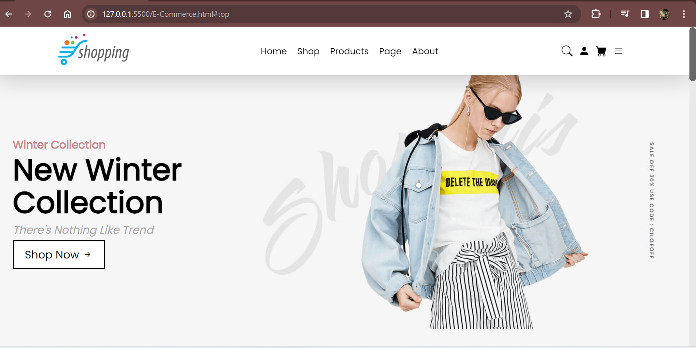
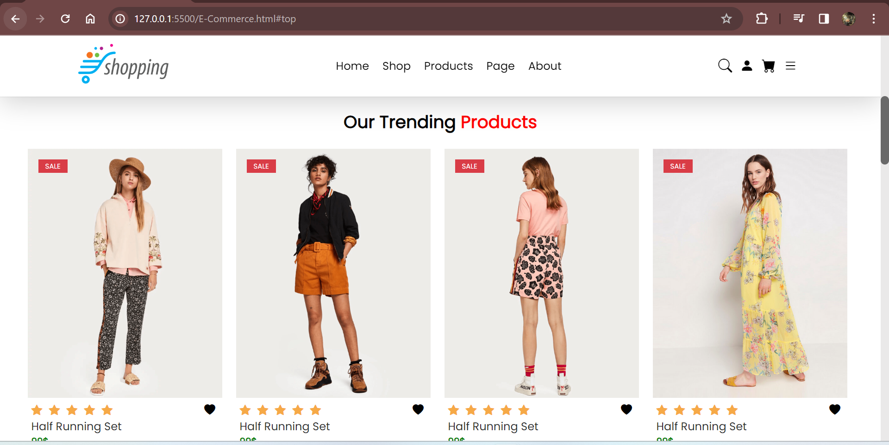

# E-Commerce Website
This project is a static e-commerce website designed to provide a clean and attractive online shopping experience using only HTML and CSS. The website showcases a range of products and includes essential pages for browsing and viewing product details, all built with a focus on responsive design and modern styling.

# Used technologies
- HTML:For the structure and content of the website.
- CSS:For styling and responsive design to ensure a consistent look across various devices.

# Preview

# GIF

